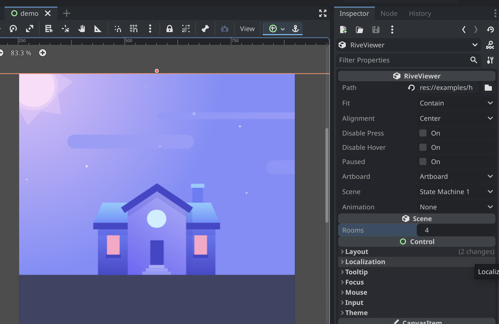

# Godot Rive

### An integration of Rive into Godot using GDExtension

> **Important**
> This extension is in **alpha**. That means:
> * Most features are implemented
> * You may encounter some bugs
> * It's untested on many platforms

This extensions adds [Rive](https://rive.app) support to Godot 4.

It makes use of the following third-party libraries:
- [`rive-cpp`](https://github.com/rive-app/rive-cpp)
- [`skia`](https://github.com/google/skia) (included in `rive-cpp`)

## Table of Contents

1. [Features](#features)
2. [Building](#building)
3. [Installation](#installation)
4. [Roadmap](#roadmap)
5. [Contributing](#contributing)
6. [Screenshots](#screenshots)

## Features

* Load `.riv` files (artboards, animations, and state machines)
* Listen for input events
* Change state machine properties in-editor and in code
* Robust API for runtime interaction
* Optimized for Godot

## Building

> **Warning**
> These instructions are only tested on M1 MacOS. You may have to modify `build/build.py` or `build/SConstruct` for your system.

The following must be installed:
- Python
- [git](https://git-scm.com/)
- [scons](https://scons.org/)
- [ninja](https://ninja-build.org/)

To build, run the following commands (from the root directory):
```bash
cd build
python build.py
```

To see the available options, run:
```bash
python build.py --help
```

## Installation

> **Important**
> If you are not on M1 MacOS, you will need to build the extension yourself. Binaries are only provided for MacOS universal (debug and release).

1. Create a folder in your project called `bin`, and copy the contents of `demo/bin` into the new folder
2. Update the paths in `rive.gdextension` to match your project folder structure

## Roadmap
- [x] Load `.riv` files
- [x] Run and play Rive animations
- [x] Raster image support
- [x] Input events (hover, pressed, etc.)
- [x] Alignment & size exported properties
- [x] Multiple scenes/artboards
- [x] Dynamic exported properties based on state machine
- [x] API for interaction during runtime
- [x] Add error handling
- [x] Add signals for event listeners (hover, pressed, etc)
- [x] Disable/enable event listeners (hover, pressed, etc) in API and editor
- [x] Optimization
- [x] Static editor preview
- [x] Animated editor preview
- [ ] Add reset button
- [ ] `.riv` ResourceLoader (thumbnails)
- [ ] Other platform support
- [ ] Any missing features

## Contributing

Help would be MUCH appreciated testing and/or building for the following platforms:
* Windows
* Android
* iOS
* Linux
* Web

Feel free to contribute bug fixes (see open issues), documentation, or features as well.

## Screenshots

